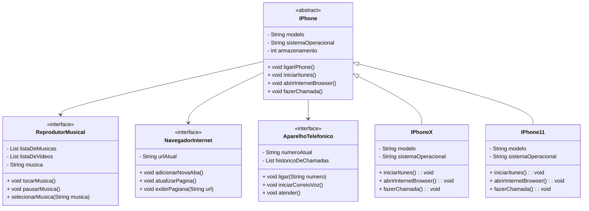

# iPhone
```Digite algo, aperte o botão e pronto```
* Sincroniza mídia, contatos, documentos com PC ou Mac, sincroniza dados da web ou do iPhone
* Conecta com wi-fi

  

| Reprodutor Musical                  | Aparelho Telefônico        | Navegador de Internet     |
| :---:                     |   :---:              |    :---:              |
|Toca músicas e vídeos       | App de ligações, conferência    |HTML, e-mail (IMAP, POP)|
|Controles sensíveis ao toque| Correio de voz visual | EDGE  (Safari)                 |
|Speaker                         |Bluetooth              |      Widget              |

## Diagrama


   
