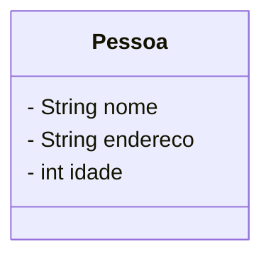
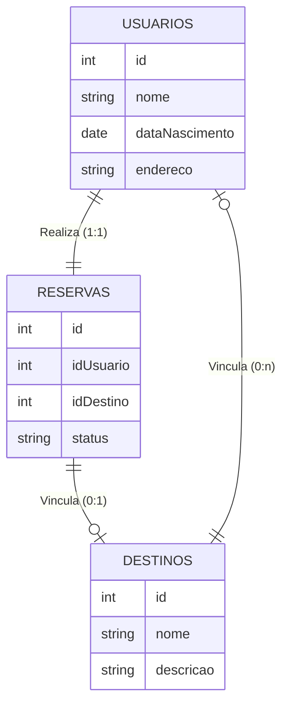

# O que é um banco de dados?

## Conceito

Coleção organizada de informações ou dados estruturados armazenados em um sistema eletrônicos. Existem banco de dados não computadorizados como biblliotecas arquivos físicos, entre outros

## Tipo de Banco de Dados

* Relacionais/SQL
* Não Relacionais/NoSQL (Not OnlySQL)
* Orientado a Objetos
* Hierárquico

## O que é SGBD?

Um banco de dados não é auto gerenciável por isso existem sistemas de gerenciamento de banco deo dados chamados de SGBD. Fornecem conjunto de ferramentas e recursos para criar, manipular, consultar e adminstrar dados e segurança.

## Funcionalidades Básicas

```CRUD```
**C**reate
**R**ead
**U**pdate
**D**elete

## Estrutura básica de um BD Relacional

Composto por um BD onde será armazenado conjunto de tabelas que podem relacionar-se entre em si.

### Tabelas

Tabelas são compostas por colunas onde são armazenadas atributos de uma determinada entidade. Cada atributo deve ser armazenado em uma coluna diferente. São usadas para armazenar dados de forma organizada. Cada tabela possui um nome único e é dividida em colunas e linhas

* **Coluna:** é uma estrutura de uma tabela que representa um atributo específico dos dados armazenados. Possui um nome único e um tipo de dado que define o tipo de informação armazenada. Ex, texto, número, data, etc.

* **Registro, linha ou tupla:** é a informação armazenada em si, ou seja informações de uma entidade armazenadas em colunas são chamadas de registro.

### Relacionamentos

Dependem das chaves primárias que são identificadores únicos dos registros das tabelas e chaves estrangeiras que sinalizam que existe um relacionamento entre as tabelas

## Características Básicas do BD

* Relacionamento entre tabelas - informações são relacionadas entre si para compor informações mais relevantes
* Linguagem de consulta estruturada (SQL) permite o relacionamento
* Integridade referencial - relacionamento são referencias entre tabelas e o sistema garante a integridade desse relacionamento
* Normalização de dados - forma de estruturação de colunas 
* Segurança - gerenciamento seguro de acesso aos dados
* Flexibilidade e extensibilidade - alteração dos schemas
*Suporte e transações ACID - garantia da consistência da informação dentro do BD

### ACID
Conjunto de propriedade que garante confiabilidade e segurnça
**A**tomicidade - garante a execução bem sucedida de operaçãoes - erros em operaçãoe não são salvas.
**C**onsistência - a operação deve sair de um estado para outro onde ambas são consistentes
**I**solamento** - cada transação é executada de forma isolada sem interferir nas transações concorrentes para evitar acesso incorreto ou incosistencia de dados. Ex. Uma transação é feita após a outra e não ao mesmo tempo
**D**urabilidade - quando a transação é confirmada a informação não é revertida ao estado anterior.

[O que é um Banco de Dados Relacional?](https://www.oracle.com/br/database/what-is-a-relational-database/)

# MER e DER : Modelagem de Banco de Dados

```MER - Modelo de Entidade-Relacionamento e DER Diagrama de Entidade de Relacionamento```

* MER é um modelo conceitual usado para representar a estrutura geral de um banco de dados. Descreve entidades, atributos, e o relacionamento entre as entidades sem entrar em detalhes de implementação e é representado através de diagramas DER -
* DER é a representação gráfica do modelo conceitual.

[Creatly](https://app.creately.com) 

## Entidade
Representação (retângulos) das tabelas que são nomeadas com substantivos concretos ou abstratos que representem a sua função. 

## Atributos
Características e propriedades da entidade. Não há atributo composto. São representados por elipses ou uma anotação do UML (lista com todos os atributos da entidade separados por linha.

## Diagrama




## Configuração do Ambiente Remoto

1. Criar Conta em [Cloud Clusters](https://www.cloudclusters.io/)
2. Selecionar aolicativo > MariaDB > Criar Banco de Dados > Criar usuário
3. Em aplicativos selecionart MyAdminPhP e inserir dados do usuário

## Comandos Básicos:

**Diagrama UML para os exemplos na BD Viagens:

# UML Diagram



CRUD [Create, Read, Update, Delete](https://github.com/lelia-salles/Banco-de-Dados-Relacional/tree/main/CRUD)

Na hora de definir a coluna pode-se passar algumas informações adicionais como:

* Restrição de valor 
    * NOT NULL (Obrigatório ou não)
    * UNIQUE informação não pode ser duplicada
    * DEFAULT um status padrão (ex. ligado, desligado)

* Chaves primárias e estrangeiras
* Auto Incremento

## Normalizar

Elimina redundâncias e anomalias, garantindo a consisteência e integridade de dados [Exemplo](https://github.com/lelia-salles/Banco-de-Dados-Relacional/tree/main/Normalizacao_de_dados)

### Formas Normais

* 1FN Atomicidade de dados:
cada valor da tabela deve ser indivisível (atômico). Nenum campo deve conter múltiplos valores ou listas. Ex. Endereço tem múltiplos valores. Para atingir a 1FN deve-se dividir o campo endereço em colunas separadas.

* 2FN 
Estabelece que uma tabela de estar primeiramente de acordo com a 1FN e que todos os atributos não-chave tem que depender totalmente da chave primária. A **chave primária** pode ser:

    * simples: uma coluna
    * composta: duas ou mais colunas

A 2FN se aplica praticamente à chave primária composta já que a simples não há possibilidade de haver dependência parcial.

* 3FN 
A tabela deve cumprir requisitos da 2FN e nenhuna coluna não-chave deve depender de outra coluna não_chave. Ex.: Estado -> Cidade, atributos devem depender do Id apenas

Pode haver tabelas que não estejam em conformidade com a 3FN sem prejudicr a consistência dos dados

**Resumo**

A 1FN garante que os registros sejam únicos e identificáveis, a 2FN garante que atributos não-chave dependam totalmente da chave primária, evitando dependências parciais e, a 3FN elimina dependências transiticas entre atributos não-chave garantindo a dependência dos mesmos apenas da chave primária, não havendo dependência indireta entre eles.

São 6 Formas Normais que podem ser encontradas [aqui](https://pt.wikipedia.org/wiki/Normaliza%C3%A7%C3%A3o_de_dados)
